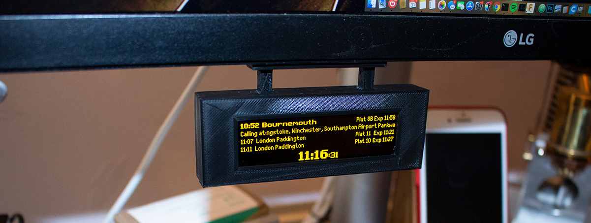
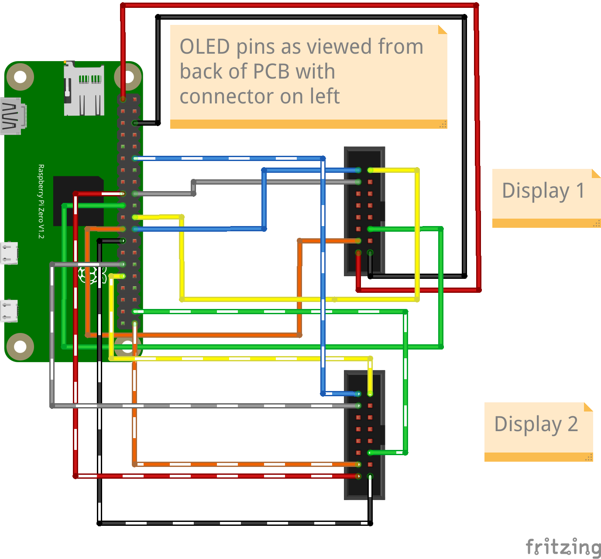

**A replica, near real-time, miniature UK railway station train departure sign based upon a Raspberry Pi Zero and 256x64 SPI OLED display(s). Uses the publicly available [OpenLDBWS API by National Rail Enquiries](https://www.nationalrail.co.uk/).**

## Highlights

- **See local departures**: Display the depatures from your local station at home for up to date train information.
- **3D-printable cases**: Print your own miniature case to keep everything tidy - both desktop and 'hanging' style available.
- **Dual display support**: Run two displays each showing departures from different platforms from a single Raspberry Pi.

   * [Installation](#installation)
   * [Configuration](#configuration)
   * [Hardware](#hardware)
   * [Credits](#credits)

## Installation

Running this project is as simple as deploying it to a balenaCloud fleet. You can do it in just a few clicks by using the button below:

Alternatively, sign up, add a fleet and device as per the [getting started](https://www.balena.io/docs/learn/getting-started/raspberrypi3/python/) guide. Then use the [balena CLI](https://github.com/balena-io/balena-cli) to push the project to your Pi.

This allows you to easily deploy multiple devices and configure them from the dashboard with the following variables.

**There is also [a full writeup on the balena blog](https://www.balena.io/blog/build-a-raspberry-pi-powered-train-station-oled-sign-for-your-desk/).** (Note: this is now somewhat outdated but still serves as a useful guide.)

## Configuration

Sign up for the [National Rail Enquiries OpenLDBWS API](http://realtime.nationalrail.co.uk/OpenLDBWSRegistration), which will generate an token for you to use as the API key.

**Note:** The API provider changed in v0.1.0 - if you are upgrading you'll need to create a new account with the link above and update the environment variables as per the table below.

These environment variables are specified using the [balenaCloud dashboard](https://www.balena.io/docs/learn/manage/serv-vars/), allowing you to set up mutiple signs in one fleet for different stations.

| Key                              | Example Value
|----------------------------------|----------
|`TZ`  | `Europe/London` ([timezone](https://en.wikipedia.org/wiki/List_of_tz_database_time_zones))
|`departureStation`  | `PAD` ([station code](https://www.nationalrail.co.uk/stations_destinations/48541.aspx))
|`destinationStation`  | `HWV` ([station code](https://www.nationalrail.co.uk/stations_destinations/48541.aspx)) [optional] Filters trains shown to only those that call at this station
|`timeOffset`  | `5` [optional] (Time offset, in minutes, for the departure board. Can be used to see into the future (positive value) or past (negative value). Set 5 if you live 5 min from the station and want to hide departures that are too soon to catch)
|`refreshTime` | `120` (seconds between data refresh)
|`screenRotation` | `2` (rotates the output of the OLED)
|`apiKey` | `f1ff949c-769e-49b3-8242-eee54fe91b94` (OpenLDBWS API key)
|`operatingHours` | `8-22` (hours during which the data will refresh at the interval above)
|`screenBlankHours` | `1-6` (hours during which the screen will be blank and data will not refresh)
| `outOfHoursName` | `London Paddington` (name shown when current time is outside the `operatingHours`)
| `dualScreen` | `True` (if you are using two displays)
| `screen1Platform` | `1` (sets the platform you want to have displayed on the first display)
| `screen2Platform` | `2` (sets the platform you want to have displayed on the second display)

If using two screens the following line needs to be added into /boot/config.txt which is achieved by using the 'Define DT overlays' option within the Device configuration screen on balenaCloud: `spi1-3cs`

## Hardware

This project requires the use of a SSD1322-based 256x64 SPI display, an OLED in yellow for the authentic look. I have used [displays from AliExpress](https://www.aliexpress.com/item/32988174566.html) successfully, but any other with the same pixel dimensions and controller chip should also work.

The connections for one of these displays to the Raspberry Pi GPIO header are as follows, but **it would be a good idea to check the connections with the datasheet of your particular display before powering on** as there's no guarantee yours will match the pinout of mine.

### Display 1

| Display | Connection | Raspberry Pi
|---|---|---
| 1 | Ground | 6 (Ground) |
| 2 | V+ (3.3V) | 1 (3v3 Power) |
| 4 | `D0/SCLK` | 23 (`BCM11 SCLK`) |
| 5 | `D1/SDIN` | 19 (`BCM10 MOSI`) |
| 14 | `DC` (data/command select) | 18 (`BCM24`) |
| 15 | `RST` (reset) | 22 (`BCM25`) |
| 16 | `CS` (chip select) | 24 (`BCM8 CE0`)

### Display 2 (optional)
| Display 2 | Connection | Raspberry Pi
|---|---|---
| 1 | Ground | 25 (Ground) |
| 2 | V+ (3.3V) | 17 (3v3 Power) |
| 4 | `D0/SCLK` | 40 (`BCM21 SCLK`) |
| 5 | `D1/SDIN` | 38 (`BCM20 MOSI`) |
| 14 | `DC` (data/command select) | 29 (`BCM5`) |
| 15 | `RST` (reset) | 31 (`BCM6`) |
| 16 | `CS` (chip select) | 12 (`BCM18 CE0`)

**Important note, if your display isn't working check this first!:** Some displays have a solder-blob or zero-ohm resistor jumper on the back of the board that you may need to move in order to enable the display for SPI communication. If you don't get any output, check this first! In the case of my display it meant moving `R6` to `R5` to enable 4SPI as dictated by a small data table printed on the back of the display board.

## Case

There are .stl 3D models for a case available in the case directory. Originally the case was a two-piece design which proved to be difficult to print. Feel free to look at the project history and retrieve the STL files if you want to give it a go, however a replacement is now available which is in multiple parts and easier to print successfully. It does require a few extra screws to hold it together, but this makes for a more robust assembly.

You'll need to print:
- 1x case body
- 1x back cover
- 2x display clamp
- 1x desk mount *OR* hanging mount

For assembly you'll need:
- 4x M1.2x4mm self tapping screws to mount the display with the clamps
- 4x M1.7x5mm self tapping screws to fit the rear cover

I usually purchase sets [like this from Amazon](https://www.amazon.co.uk/gp/product/B0915DPHV2) which last a while.

For printing I recommend orientating the parts as below, noting that the hanging mount will require supports, although I also recommend blocking the supports from filling the holes - they can be tough to remove and should print OK without support.

You should find that the case body prints slightly larger than necessary for the OLED to fit, the reason for this is to give you the freedom to center the display within the window on the front. I have found that the displays vary slightly when it comes to location of the display panel itself and sometimes are not centered.

## Credits

A big thanks to [Chris Hutchinson](https://github.com/chrishutchinson/) who originally started this project and inspired me to develop it further. [Blake](https://github.com/ghostseven) made some further improvements and this project was forked from [there](https://github.com/ghostseven/UK-Train-Departure-Display).

The fonts used were painstakingly put together by `DanielHartUK` and can be found on GitHub at https://github.com/DanielHartUK/Dot-Matrix-Typeface - A huge thanks for making that resource available!

Thanks to [@jajasilver](https://github.com/jajsilver/UK-Train-Departure-Display-NRE) and [@MatthewAscough](https://github.com/MatthewAscough/UK-Train-Departure-Display-NRE) for forming the basis of the OpenLDBWS implementation.
